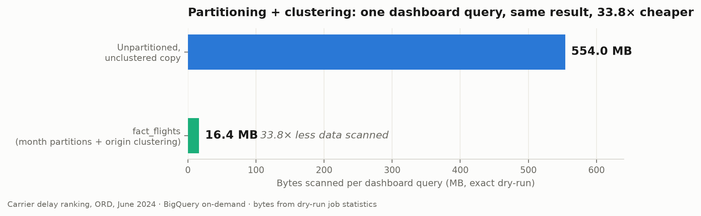

# fact_flights partitioning + clustering benchmark

**Claim (blog/resume-ready):** Partitioning `fact_flights` by month and
clustering by origin airport cut a representative dashboard query — the carrier
delay ranking for one airport-month (ORD, June 2024) — from **554.0 MB scanned
to 16.4 MB, a 33.8× reduction**, measured with exact BigQuery dry-run job
statistics. At on-demand pricing ($6.25/TiB) that is **$0.00315 → $0.000095 per
query (33×)**, roughly **$306 saved per 100,000 dashboard queries**, and median
runtime dropped 1.8× (367 ms → 206 ms). Same query, same result — the only
difference is table layout.

## Before / after

| | Unpartitioned, unclustered copy | `fact_flights` (month partitions, origin/dest/carrier clustering) | Improvement |
|---|---|---|---|
| Bytes scanned (exact, dry run) | 553,975,488 B (554.0 MB) | 16,411,824 B (16.4 MB) | **33.8×** |
| Bytes billed (job stats) | 554,696,704 B | 16,777,216 B | 33.1× |
| Est. cost per query (on-demand $6.25/TiB) | $0.003153 | $0.0000954 | **33.1×** |
| Median runtime (3 runs, cache off) | 367 ms | 206 ms | 1.8× |
| Cost per 100,000 queries | $315.31 | $9.54 | −$305.77 |

## Method

- Query: `benchmark_query.sql` — carrier delay ranking filtered to one month
  (`date_key`, the partition column) and one origin airport
  (`origin_airport_key`, the first clustering column); the exact drill-down a
  dashboard fires.
- Baseline: `CREATE TABLE ... AS SELECT * FROM fact_flights` with no
  partitioning/clustering (verified via INFORMATION_SCHEMA DDL), dropped after
  measurement; this file + the query recreate the benchmark.
- Bytes scanned from dry-run `totalBytesProcessed` (exact); billed bytes,
  cache-hit status (all false), and runtimes from real job statistics,
  3 runs per variant, run 2026-07-09.
- Both variants benefit equally from BigQuery's columnar pruning (only the five
  referenced columns are read); the 33.8× is partition + cluster pruning alone.
